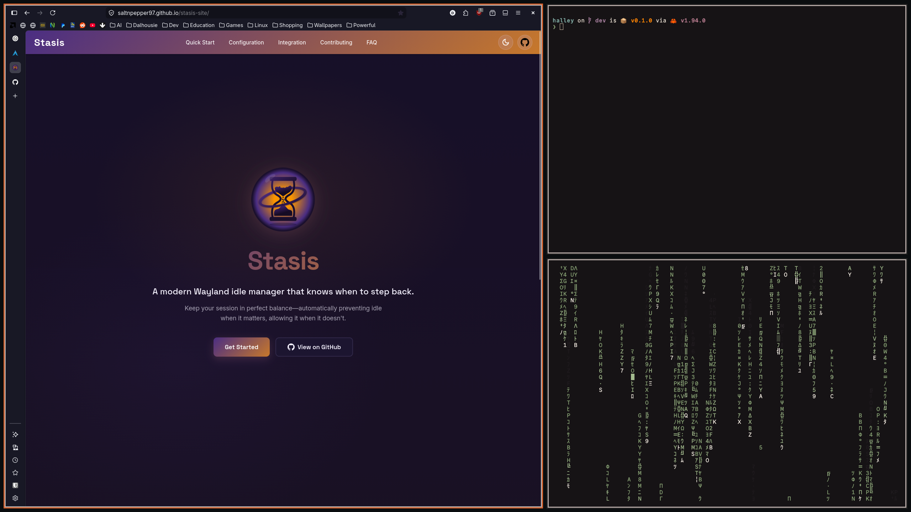

<h1 align="center">Halley</h1>

<p align="center"><em>Named after Halley's comet — periodic, precise, returning.</em></p>

<p align="center">
  <a href="https://saltnpepper97.github.io/halley-site/"><strong>Website</strong></a>
</p>


---

> **Windows as nodes. Windows as clusters. Windows as your command center.**

Halley is a Wayland compositor built from the ground up for multi-monitor setups. Each display gets its own independent infinite canvas. Windows live as nodes on those canvases, group into clusters you build intentionally, and decay gracefully when they drift out of focus. Inspired by the comet it's named after — periodic, precise, and always returning — Halley makes multi-monitor work feel deliberate rather than chaotic.

---

## Demo




---

## Concepts

A quick orientation before diving in.

| Term | What it is |
|---|---|
| **Field** | An infinite 2D canvas, one per monitor. Everything lives here. Zoomable and pannable. |
| **Node** | A window on the Field — open, collapsed, or a cluster core. |
| **Focus Ring** | An invisible eye-shaped region defining your active area. Windows outside it are candidates for decay. |
| **Decay** | Nodes that drift outside the focus ring dim or collapse over time. Optional and configurable. |
| **Cluster** | Halley's answer to workspaces — a contained layout you build intentionally from a set of windows. |
| **Core** | The collapsed form of a cluster on the Field. Expands into a petal arrangement of window previews. |
| **Trail** | History-aware navigation — step backward and forward through recent focus changes. |
| **Bearings** | A lightweight directional overlay for orienting movement and navigation around the current view. |
| **Jump** | Move a grabbed window across monitors, traversing between Fields, with a single keybind. |

---

## The Field

Multi-monitor is a first-class concept in Halley — not an afterthought. Each monitor gets its own infinite canvas, completely independent from every other display. The Field is zoomable, pannable, and isolated per monitor.

- **Per-monitor** — displays don't share state; each Field is its own world
- **Max windows** — configurable cap on open nodes per Field
- **Decay** — opt-in clutter management based on focus ring position; a small overlap tolerance prevents edge-case false positives
- **Jump** — grab a window and send it to another monitor's Field with one keybind; `Super+Shift+LeftMouse` for a pointer-driven field jump

The **Focus Ring** is the heart of the Field. It's an invisible eye-shaped region centered on your view — windows that fall significantly outside it over time become candidates for decay. You can make it briefly visible via config; it fades out after a moment. Size and shape are fully configurable.

---

## Clusters

Clusters are Halley's answer to workspaces — but you build them yourself, intentionally, rather than having them auto-generated.

### Building a cluster

Enter cluster mode, then click or mark the windows you want to group. Press `Enter` to form the cluster, or `Esc` to cancel and return to the Field. Once formed, the cluster collapses into a **core node** on the Field — a single handle representing the whole group.

### The core

Clicking a core within the focus ring **enters** the cluster. Expanding it fans the windows out in a **petal arrangement** — clockwise or counter-clockwise — as icon-sized previews around the core. From there you can:

- Pull windows out into the Field
- Bring Field windows in
- Collapse it back into the core

### Inside a cluster

Once inside, you leave the Field entirely. The cluster is its own contained space with one of two layout modes:

**Tiling** — Weighted tiling. Windows are arranged by assigned weight and recency.

**Stacking** — Windows layered in a navigable stack, similar to a mobile app switcher. Navigate with keybinds, reorder the stack as needed.

---

## Systems

| System | Description |
|---|---|
| **Field** | Per-monitor infinite canvases with zoom and pan |
| **Clusters** | Core nodes, cluster entry/exit, tiling, stacking, drag reordering |
| **Focus Ring** | Configurable active region with optional preview |
| **Decay** | Optional clutter reduction outside the focus ring |
| **Trail** | Recent-focus navigation — back and forward |
| **Bearings** | Directional overlays and navigation cues |
| **Jump / Field Jump** | Fast cross-monitor grabbed-window movement |
| **IPC** | Unix socket control at `$XDG_RUNTIME_DIR/halley/halley.sock` |
| **Xwayland** | On-demand support via `xwayland-satellite` |

---

## Requirements

Halley targets a native Linux Wayland session and expects:

- A DRM/KMS-capable graphics stack with GBM/EGL/OpenGL support
- A seat/session backend through `libseat` such as `seatd` or logind
- `libinput` and `udev` access on a real TTY for the native backend
- Rust and Cargo if you are building from source

Optional but commonly needed:

- `xwayland-satellite` for X11 app support
- `xdg-desktop-portal-wlr` for portal-driven screenshot and screencast flows and `xdg-desktop-portal-gtk`
- `fuzzel` plus a Wayland terminal such as `ghostty`, `kitty`, `foot`, `wezterm`, `alacritty`, `rio`, or `contour` if you use the default launch bindings

---

## Install

### AUR

    yay -S halley    

or

    paru -S halley

Or for the latest commit:

    yay -S halley-dev

or

    paru -S halley-dev

### From Source

```bash
git clone https://github.com/saltnpepper97/halley
cd halley
cargo build --release
